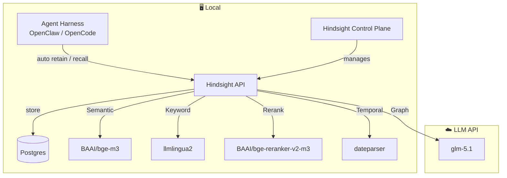

# Al Jal Ttak Kkal Sen

"Al Jal Ttak Kkal Sen" is the Korean alphabet rendering of 알잘딱깔센 — roughly, "doing the right thing, cleanly, with good sense."

## Architecture



- `BAAI/bge-m3` is a multilingual embedding model with Korean support.
- `BAAI/bge-reranker-v2-m3` is a multilingual cross-encoder reranking model with Korean support.
- `llmlingua2` is a multilingual tokenizer with Korean support.

## Setup

```sh
uv run setup
```

### .env

See `.env.example`

### Run

Hindsight API:
```sh
tmux new -s hsa 'uv run --env-file .env hindsight-api'
```

View logs: `tmux capture-pane -t hs-api -p -S -500`

Hindsight Control Plane:
```sh
tmux new -s hsw 'uv run --env-file .env pnpm hindsight-control-plane'
```

OpenClaw Gateway:
```sh
tmux new -s oc 'openclaw gateway run'
```
